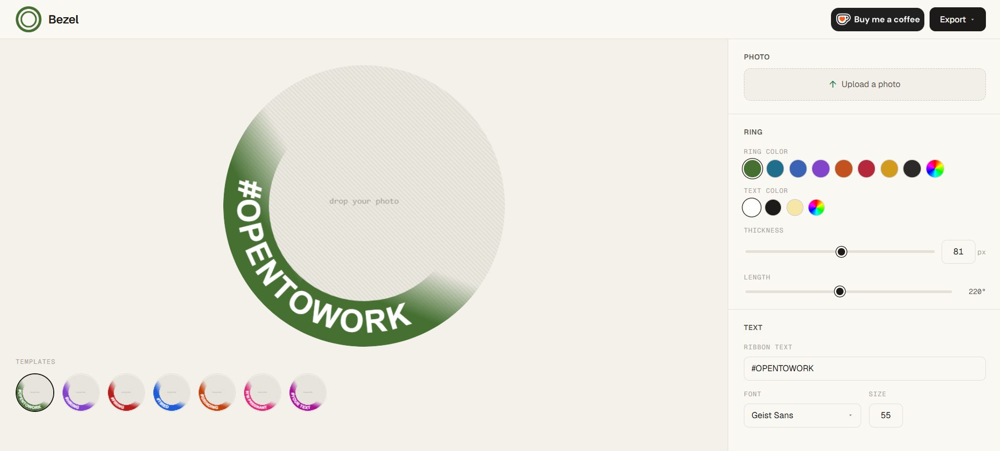

# Bezel — Be Seen. Be Trusted.

Generate custom LinkedIn profile frames directly in your browser. Upload your photo, pick a template, tweak the style, and export a ready-to-upload PNG in seconds.



---

## Features

- **7 ready-made templates** — #OpenToWork, #Hiring, #Firing, #Tired, #Grinding, #I'mPregnant, and a fully customizable option
- **Live preview** — see every change reflected instantly on the canvas
- **Photo upload & crop** — drag to reposition your photo inside the frame
- **Customizable ring** — adjust color, thickness, arc length, and fade
- **Custom text** — change the ribbon text, font, size, and color
- **One-click export** — downloads a 500×500 PNG ready for LinkedIn
- **Fully responsive** — works on desktop and mobile

---

## Tech stack

- [React](https://react.dev/) + [TypeScript](https://www.typescriptlang.org/)
- [Vite](https://vitejs.dev/) — build tooling
- [Zustand](https://github.com/pmndrs/zustand) — state management
- Canvas 2D API — all rendering done natively, no canvas libraries
- [react-colorful](https://github.com/omgovich/react-colorful) — color picker

---

## Run locally

```bash
git clone https://github.com/moha-elh/Bezel.git
cd Bezel
npm install
npm run dev
```

Open [http://localhost:5173](http://localhost:5173) in your browser.

---

## Build

```bash
npm run build
```

Output goes to `dist/`.

---

## Support

If this tool saved you time, consider buying me a coffee ☕

[](https://ko-fi.com/D6J4222HPP)
